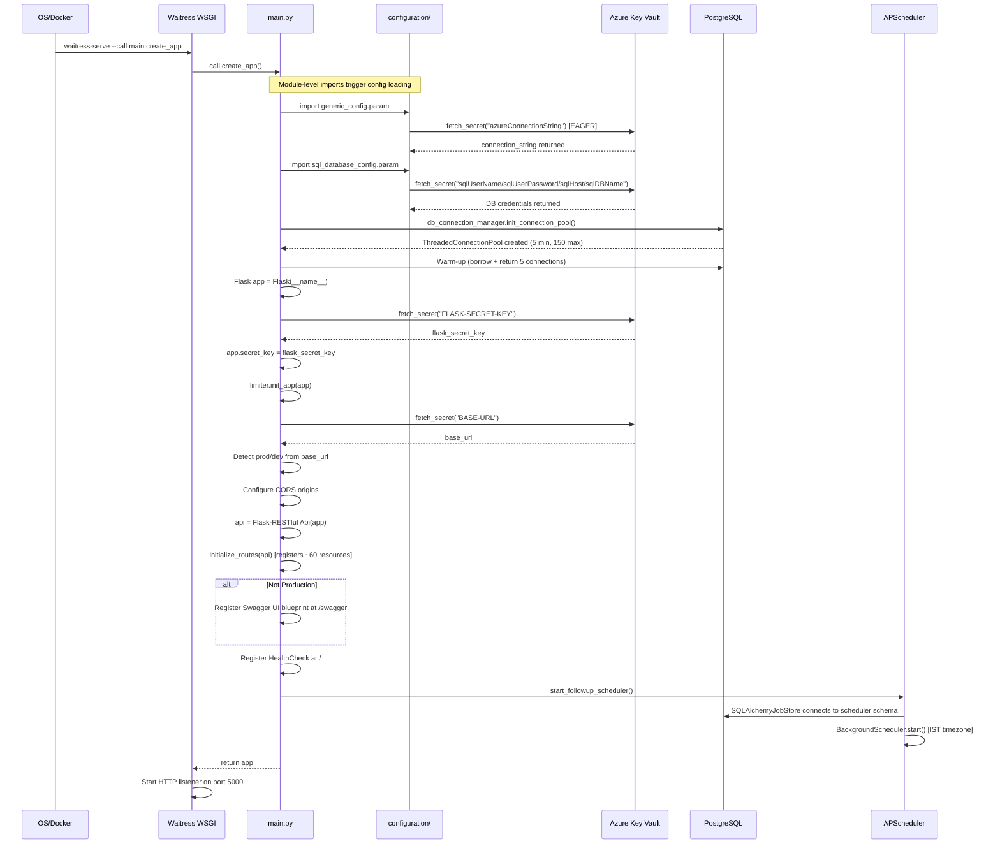

# 4. Application Startup Flow

## 4.1 Entry Points

| Mode | Command | Entry Point |
|------|---------|------------|
| Production | `waitress-serve --port=5000 --call main:create_app` | `main.create_app()` |
| Development | `python main.py` | `main.py → if __name__ == "__main__"` |
| Docker | CMD in Dockerfile | `waitress-serve ...` |

---

## 4.2 Initialization Sequence



---

## 4.3 Config Loading Detail

All configuration uses **lazy-loaded singleton properties** with one exception:

```python
# generic_config.py — EAGER load at class definition time (not a property):
connection_string = fetch_secret_from_azure("azureConnectionString")

# All others are lazy properties:
@property
def flask_secret_key(self):
    if self._flask_secret_key is None:
        self._flask_secret_key = fetch_secret_from_azure("FLASK-SECRET-KEY")
    return self._flask_secret_key
```

**Implication:** The Azure connection string is fetched when `configuration/generic_config.py` is first imported — even before `create_app()` runs. Any import chain that reaches `generic_config` will trigger a Key Vault call.

---

## 4.4 Environment Detection

The application detects its environment from the `BASE-URL` secret in Azure Key Vault:

```python
base_url = param().base_url  # fetched from KV

if base_url == "https://marketminderai.compunnel.com":
    is_prod = True
    origins = ["https://marketminderai.compunnel.com"]
else:
    is_prod = False
    origins = [
        "http://localhost:5173",           # Local Vite dev server
        "https://marketminderai-dev.compunnel.com"  # Dev deployment
    ]
```

**Consequences of environment:**
- Production: Swagger disabled, CORS locked to prod domain
- Non-production: Swagger enabled at `/swagger`, CORS includes localhost:5173

---

## 4.5 Route Registration

All 60+ API routes are registered in `api/routes.py → initialize_routes(api)`:

```python
def initialize_routes(api):
    api.add_resource(ResourceClass, "/api/path")
    # ... for all resources
```

Routes are **flat-registered** (no Flask blueprints used for routing). The route string directly maps to the resource class.

---

## 4.6 Middleware Chain

Flask middleware applied at app level:
1. **Flask-Compress** — gzip/brotli compression (from requirements, inferred enabled)
2. **Flask-CORS** — Cross-origin policy enforcement
3. **Flask-Limiter** — Rate limiting (initialized but individual limits set per endpoint)
4. **Flask-RESTful error handling** — Wraps exceptions into JSON responses

Per-request middleware (decorator chain on each Resource method):
```
Request
  → @token_required          (validates JWT presence + signature)
  → @permission_required()   (checks module+permission in JWT payload)
  → @extract_user_id         (extracts user_id, sets None for admin/superadmin)
  → Resource.get() / .post()
```

---

## 4.7 APScheduler Startup

```python
# helpers/scheduler_config.py
scheduler = BackgroundScheduler(
    jobstores={
        'default': SQLAlchemyJobStore(
            url=f'postgresql://{user}:{password}@{host}:{port}/{database}',
            tablename='apscheduler_jobs',
            metadata=MetaData(schema='scheduler')
        )
    },
    timezone=IST  # Asia/Kolkata
)

def start_followup_scheduler():
    scheduler.start()
    # Jobs are added dynamically when follow-up emails are scheduled
```

The scheduler starts as a **background thread** within the Waitress process. Jobs persist in PostgreSQL so they survive app restarts.

---

## 4.8 Health Check Endpoint

```
GET /
Response: {"status": "API is running"}
```

No authentication required. Suitable for load balancer health checks.

---

## 4.9 Pool Status Endpoint

```
GET /pool_status
```

Returns current state of the PostgreSQL connection pool (used connections, available connections, total). Useful for operational monitoring.

---

## 4.10 Database Pool Warm-Up

On startup, the pool borrows and immediately returns `POOL_MINCONN` (5) connections to pre-establish TCP connections, reducing first-request latency:

```python
warmup_conns = []
for _ in range(POOL_MINCONN):
    conn = connection_pool.getconn()
    warmup_conns.append(conn)
for conn in warmup_conns:
    connection_pool.putconn(conn)
```

If the DB is unreachable on startup, the app retries 5 times with 3-second delays before raising a `RuntimeError` that will crash the container.
