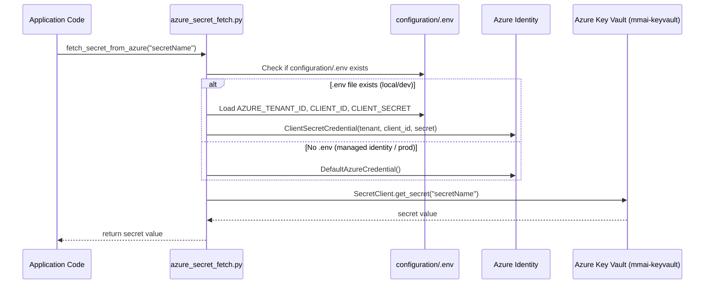

# 5. Environment & Configuration

## 5.1 Secret Management Architecture

**Market Minder uses Azure Key Vault as its single source of truth for all secrets.** No application secrets are stored in environment variables, `.env` files, or source code.

The `configuration/.env` file holds only the **service principal credentials** needed to authenticate to Key Vault:

```
AZURE_TENANT_ID=<tenant-id>
AZURE_CLIENT_ID=<client-id>
AZURE_CLIENT_SECRET=<client-secret>
```

When deployed in a cloud environment without a local `.env` file (e.g., Azure-hosted VM/container with Managed Identity), `DefaultAzureCredential` is used automatically.

---

## 5.2 Secret Fetch Flow



**Key Vault Name:** `mmai-keyvault`  
**Key Vault URI:** `https://mmai-keyvault.vault.azure.net/`

---

## 5.3 All Known Secret Names in Azure Key Vault

| Secret Name | Used In | Purpose |
|-------------|---------|---------|
| `azureConnectionString` | `generic_config.py` | Azure Storage (Tables, Blobs, Queues) |
| `genericSecretKey` | `generic_config.py` | JWT signing key |
| `genericSessionKey` | `generic_config.py` | Session key |
| `genericMailchimpApiKey` | `generic_config.py` | Mailchimp API key |
| `ggenericMMdomain` | `generic_config.py` | Market Minder sender domain |
| `MailchimpSubaccountID` | `generic_config.py` | Mailchimp subaccount |
| `FLASK-SECRET-KEY` | `generic_config.py` | Flask session secret |
| `BASE-URL` | `generic_config.py` | App base URL (determines prod/dev mode) |
| `MCMP-API-KEY` | `generic_config.py` | MessageHarbour API key |
| `MCMP-SECRET-KEY` | `generic_config.py` | MessageHarbour secret key |
| `MCMP-API-URL` | `generic_config.py` | MessageHarbour API endpoint |
| `ZeroBounceApiKey` | `generic_config.py` | ZeroBounce email validation key |
| `SendGridToken` | `generic_config.py` | SendGrid token (fallback/alternative) |
| `mcmpquotaapikey` | `generic_config.py` | MCMP quota check API key |
| `MCMPWebhookToken` | `generic_config.py` | MCMP webhook validation token |
| `sqlUserName` | `sql_database_config.py` | PostgreSQL username |
| `sqlUserPassword` | `sql_database_config.py` | PostgreSQL password |
| `sqlHost` | `sql_database_config.py` | PostgreSQL host |
| `sqlDBName` | `sql_database_config.py` | PostgreSQL database name |
| `gmOpenaiKey` | `generate_mail_config.py` | OpenAI API key |
| `gmApiType` | `generate_mail_config.py` | OpenAI API type (azure/openai) |
| `gmApiBase` | `generate_mail_config.py` | OpenAI API base URL |
| `gmApiVersion` | `generate_mail_config.py` | OpenAI API version |
| `gmApiKey` | `generate_mail_config.py` | Azure OpenAI deployment key |
| `gmengine` | `generate_mail_config.py` | OpenAI model/deployment name |
| `openRouterApiKey` | `generate_mail_config.py` | OpenRouter LLM API key |
| `geminiApiKey` | `generate_mail_config.py` | Google Gemini API key |
| HubSpot client ID/secret | `Hubspot_config.py` | HubSpot OAuth credentials |
| Salesforce credentials | `salesforce_config.py` | Salesforce OAuth credentials |
| LinkedIn/Proxycurl key | `linkedIn_config.py` | Proxycurl API key |

> **Security Note:** Never log or print secret values. All secret fetch calls are wrapped in lazy properties that cache values in private class attributes after first fetch.

---

## 5.4 Configuration Classes

### `configuration/generic_config.py` — `class param`
Central configuration class. Contains all application-level secrets.

```python
param().flask_secret_key    # Flask session key
param().secret_key          # JWT signing secret
param().connection_string   # Azure Storage connection string (EAGER loaded)
param().base_url            # App base URL
param().mcmp_api_key        # MessageHarbour API key
param().mcmp_api_url        # MessageHarbour API endpoint
param().zero_bounce_api_key # ZeroBounce key
param.use_mailchimp         # Class-level flag: True=Mailchimp, False=MCMP
```

### `configuration/sql_database_config.py` — `class param`
PostgreSQL connection credentials:
```python
param().sql_username        # DB username
param().sql_password        # DB password
param().sql_host            # DB host
param().sql_database_name   # DB name
```
Port is hardcoded to `5432`.

### `configuration/generate_mail_config.py` — `class param`
LLM API credentials:
```python
param().openai_key
param().gemini_api_key
param().open_router_key
param().api_type, .api_base, .api_version, .engine  # Azure OpenAI
param.trigger_table_name    # "triggertable" — Azure Table for automation
```

### `configuration/azure_config.py` — `class param`
Azure Table names and Key Vault URI (static, no secrets):
```python
param.userProfileTable      # "userProfileData"
param.unSubscribedTable     # "unSubscribedData"
param.KVUri                 # "https://mmai-keyvault.vault.azure.net/"
```

### `configuration/integration_config.py`
OAuth config for CRM integrations:
- `salesforce_config`: CONNECTOR_ID=1, OAuth URLs, redirect URI
- `hubspot_config`: CONNECTOR_ID=2, OAuth URLs, PKCE scopes, API URLs

---

## 5.5 Feature Flags

| Flag | Location | Values | Effect |
|------|----------|--------|--------|
| `param.use_mailchimp` | `generic_config.param` | `True` / `False` (default: `False`) | Toggles email provider between Mailchimp Transactional and MessageHarbour (MCMP) |

This is a **code-level feature flag** (class attribute), not driven by a secret or environment variable. Changing it requires a code change and redeployment.

---

## 5.6 Azure Storage Tables Used

| Table Name | Azure Config Ref | Purpose |
|------------|-----------------|---------|
| `userProfileData` | `azure_config.param.userProfileTable` | User LinkedIn profiles |
| `unSubscribedData` | `azure_config.param.unSubscribedTable` | Unsubscribed email list |
| `triggertable` | `generate_mail_config.param.trigger_table_name` | Alert switch per LinkedIn user |
| Domain type table | Managed via `domain_type_azure_table_helper.py` | Domain type lookup |
| Company type table | Managed via `company_type_azure_table_helper.py` | Company type lookup |
| Salesforce campaign table | `azure_table_helper_for_sf.py` | SF campaign name cache |

---

## 5.7 Azure Blob Containers Used

| Container | Purpose |
|-----------|---------|
| `draft-attachments` | Email draft file attachments |
| `public-assets` | Static assets (e.g., Market Minder logo for reports) |
| LinkedIn profile images | Stored by Proxycurl identifier (inferred from enrichment code) |
| Reports | PDF reports generated by Playwright (directory: `/app/reports`) |

---

## 5.8 Local Development Configuration

For local development:
1. Create `configuration/.env` with Azure service principal credentials
2. The app will authenticate to Key Vault using `ClientSecretCredential`
3. All secrets are then fetched transparently at first use
4. No mock configuration is needed if Key Vault is accessible

For completely offline development:
- Mock `configuration/azure_secret_fetch.fetch_secret_from_azure` to return test values
- See `unit_test/test_api/conftest.py` for how tests handle this
