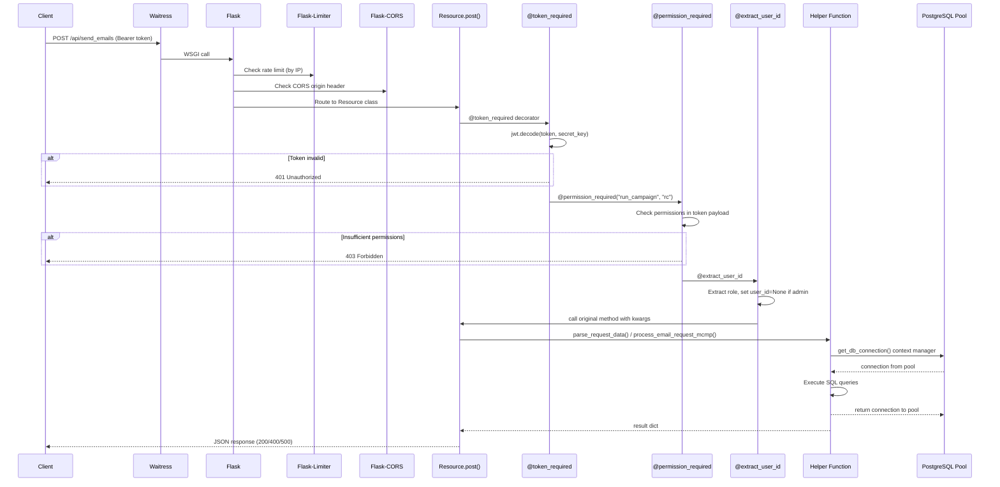
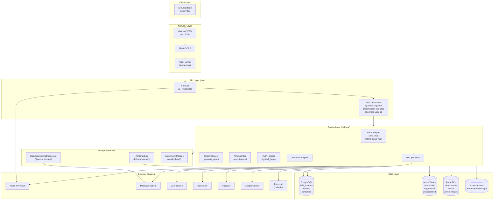

# 6. Backend Architecture

## 6.1 Layered Architecture

Market Minder follows a **3-layer monolithic architecture**:

```
┌─────────────────────────────────────────────┐
│              HTTP / API Layer               │
│  api/**/*.py  (Flask-RESTful Resources)     │
│  - Request parsing                          │
│  - Auth decorator application               │
│  - Response formatting                      │
│  - Error boundary (try/except → HTTP codes) │
└───────────────────┬─────────────────────────┘
                    │ calls
┌───────────────────▼─────────────────────────┐
│          Business Logic / Service Layer     │
│  helpers/**/*.py                            │
│  - Domain logic                             │
│  - DB queries                               │
│  - External API calls                       │
│  - Data transformations                     │
│  - Workflow orchestration                   │
└──────┬────────────────────────────┬─────────┘
       │                            │
┌──────▼──────────┐     ┌──────────▼──────────┐
│  Data Layer     │     │  External Services  │
│  PostgreSQL     │     │  Azure Storage      │
│  (psycopg2)     │     │  MCMP/Mailchimp     │
│  Azure Tables   │     │  ZeroBounce         │
│  Azure Blobs    │     │  Proxycurl          │
│  Azure Queues   │     │  Salesforce         │
└─────────────────┘     │  HubSpot            │
                        │  Google Gemini      │
                        └─────────────────────┘
```

---

## 6.2 Request Lifecycle



---

## 6.3 Service Boundaries

### Boundary 1: HTTP ↔ Business Logic
- API layer calls helper functions and passes raw data dictionaries
- Helpers return Python dicts/lists, never Flask response objects
- The API layer is responsible for calling response builders (`success_response`, `bad_request_response`, etc.)

### Boundary 2: Business Logic ↔ Database
- All DB access goes through `get_db_connection()` context manager
- No raw psycopg2 connection objects escape helpers
- SQL is inline raw SQL strings with parameterized queries (no ORM)

### Boundary 3: Business Logic ↔ External APIs
- External API calls are wrapped in individual helper modules
- Each external integration has its own config class in `configuration/`
- Error handling wraps external calls and returns structured error dicts

---

## 6.4 Response Standardization

All API responses use builders from `helpers/response.py`:

```python
# 200 OK
success_response(message, data)
# Returns: {"statuscode": 200, "message": ..., "data": [...], "total_records": N, "error": []}

# 400 Bad Request
bad_request_response(message, errors)
# Returns: {"statuscode": 400, "message": ..., "data": [], "total_records": 0, "error": [...]}

# 500 Internal Server Error
internal_server_response(errors)
# Returns: {"statuscode": 500, "message": "internal server error", "data": [], ...}

# 401 Unauthorized
unauthorised_response(message)
# Returns: {"statuscode": 401, ...}, 401

# 403 Forbidden
forbidden_response(message)
# Returns: {"statuscode": 403, ...}, 403
```

**Note:** `success_response` always returns HTTP 200. The internal `statuscode` field is informational, not the HTTP status code.

---

## 6.5 Auth Decorator Chain

Three auth-related decorators can be stacked:

```python
@token_required                          # Layer 1: JWT validation
@permission_required("campaign", "r,c")  # Layer 2: Module RBAC check
@extract_user_id                         # Layer 3: User scope injection
def post(self, user_id=None):
    ...
```

**Decorator application order matters:**
1. `@token_required` — validates JWT signature only; no permission check
2. `@permission_required(module, perms)` — re-decodes JWT, checks permissions dict in token
3. `@extract_user_id` — re-decodes JWT, injects `user_id` (None for admin/superadmin, actual ID for others)

Each decorator independently decodes the JWT. This is redundant but safe. A refactor opportunity exists to decode once and pass through.

---

## 6.6 Shared State & Thread Safety

| Shared State | Thread Safety |
|-------------|--------------|
| `connection_pool` (psycopg2.ThreadedConnectionPool) | Thread-safe by design |
| `BackgroundEmailProcessor.active_tasks` (dict) | NOT thread-safe — concurrent task updates could race |
| `scheduler` (APScheduler BackgroundScheduler) | Thread-safe — APScheduler manages its own locking |
| `param()` instances | Instance-level, no true singleton — each call creates new instance but lazy-loads from class-level cache via `_secret_key` class vars |
| Rate limiter (Flask-Limiter) | In-memory — not shared across multiple processes |

---

## 6.7 Email Service Dispatch Architecture

The email sending path has a dual-provider architecture:

```
POST /api/send_emails
  → parse_request_data()
  → if param.use_mailchimp == False:
       process_email_request_mcmp()
         → validate emails (ZeroBounce, with 30-day PostgreSQL cache)
         → send_emails_in_background() [daemon thread]
             → send_bulk_emails_via_messageharbour()
  → elif param.use_mailchimp == True:
       process_email_request()
         → send_email_function() [Mailchimp Transactional]
```

The switch is a **static class attribute** (`param.use_mailchimp = False`). There is no runtime toggle — it requires a code change.

---

## 6.8 User Scope Architecture

Three user access scopes are enforced via `@extract_user_id`:

| Role | `user_id` injected | `department_id` injected | Data Scope |
|------|-------------------|------------------------|-----------|
| superadmin | `None` | `None` | All data across all departments |
| admin | `None` | department_id from token | All data within their department |
| regular user | actual user_id | — | Only their own data |

Helpers then use these parameters to add WHERE clauses:
```sql
-- Superadmin: no user_id filter
SELECT * FROM "MM_schema".campaign;

-- Admin: filter by department
SELECT * FROM "MM_schema".campaign WHERE department_id = %s;

-- User: filter by owner
SELECT * FROM "MM_schema".campaign WHERE created_by = %s;
```

---

## 6.9 Architecture Diagram


