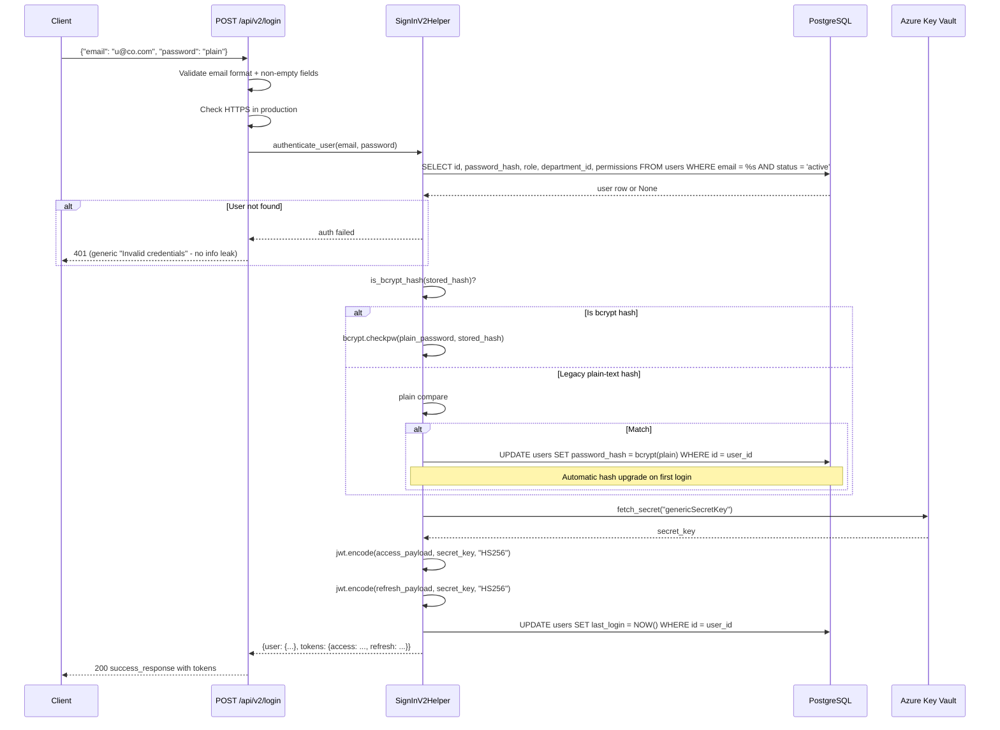
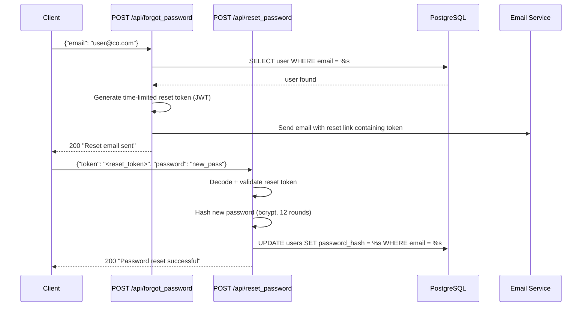
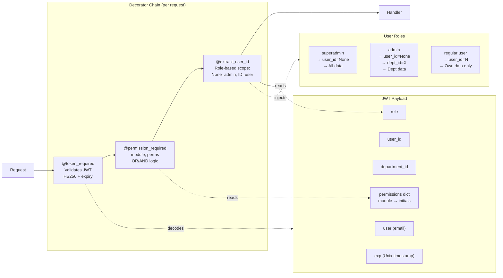

# 7. Authentication & Authorization

## 7.1 Authentication System Overview

Market Minder implements **two parallel authentication systems**:

| Version | Endpoint | Description |
|---------|----------|-------------|
| **V1 (Legacy)** | `POST /api/login` | Plain password comparison, generates JWT without refresh token |
| **V2 (Current Standard)** | `POST /api/v2/login` | bcrypt password verification, JWT access token + refresh token |

V2 is the actively maintained system. V1 should be considered deprecated.

---

## 7.2 JWT Token Structure

### Access Token Payload (V2)
```json
{
  "user": "user@company.com",
  "user_id": 42,
  "department_id": 5,
  "role": "admin",
  "permissions": {
    "campaign": "r,c,u,d",
    "dashboard": "r",
    "run_campaign": "rc",
    "users_and_roles": "r,c",
    "analytics": "r",
    "report": "c"
  },
  "exp": 1715000000
}
```

### Refresh Token Payload (V2)
```json
{
  "user_id": 42,
  "type": "refresh",
  "exp": 1715600000
}
```

**Signing Algorithm:** HS256  
**Access Token TTL:** 7200 seconds (2 hours)  
**Refresh Token TTL:** 604800 seconds (7 days)  
**Secret Key:** fetched from Azure Key Vault as `genericSecretKey`

---

## 7.3 Permission Model (RBAC)

### Permission Modules
Each user's JWT contains a `permissions` dict keyed by module name. Values are comma-separated initials:

| Initial | Permission |
|---------|-----------|
| `r` | read |
| `c` | create |
| `u` | update |
| `d` | delete |
| `rc` | run_campaign |

### Permission Modules in Use
| Module Key | Used By |
|-----------|---------|
| `campaign` | Campaign management APIs |
| `run_campaign` | Email generation + sending APIs |
| `dashboard` | Dashboard analytics |
| `analytics` | Operational analytics |
| `report` | Report generation |
| `users_and_roles` | User/role/department management |
| (others inferred) | Future modules |

### Permission Check Logic

```python
@permission_required("campaign", "r,c")
# User must have AT LEAST ONE of "r" or "c" in campaign module (OR logic, default)

@permission_required("users_and_roles", "c,r,u", require_all=True)
# User must have ALL of "c", "r", "u" in users_and_roles (AND logic)
```

---

## 7.4 Auth Decorator Reference

### `@token_required`
```python
# File: helpers/authenticate.py
# Purpose: Validates JWT is present and signature is valid
# Does NOT check permissions
# Fails with 401 if token missing or invalid
```

### `@permission_required(module, required_permissions, require_all=False)`
```python
# File: helpers/authenticate.py
# Purpose: Validates JWT + checks module permissions
# Also passes token_data to endpoint if function signature accepts it
# Fails with 401 if token invalid, 403 if permissions insufficient
```

### `@extract_user_id` (two versions)
```python
# helpers/authenticate.py — Full version with department_id support
# helpers/user_specfic_helper.py — Simpler version (admin/superadmin → None)
# Purpose: Injects user_id (and department_id for admin) from token into kwargs
# Must be used AFTER @token_required
```

---

## 7.5 V2 Login Flow



---

## 7.6 Refresh Token Flow

```
POST /api/v2/refresh-token
Body: {"refresh_token": "<token>"}

→ Decode refresh token (validates exp + type="refresh")
→ Generate new access token
→ Return new access_token (refresh token NOT rotated)
```

**Security Note:** Refresh tokens are not rotated on use. A stolen refresh token remains valid until it expires (7 days). Token revocation is not implemented.

---

## 7.7 Password Reset Flow



---

## 7.8 User Onboarding Flow

New users are created by admins, not self-registered:

```
POST /api/onboard_create_password
→ User clicks link in onboarding email
→ Sets their own password for first time
→ bcrypt hash stored
```

---

## 7.9 Change Password Flow

```
POST /api/auth/change-password
Headers: Authorization: Bearer <token>
Body: {"old_password": "...", "new_password": "..."}

→ @token_required validates JWT
→ Verify old_password against stored hash
→ Hash new_password with bcrypt (12 rounds)
→ UPDATE users SET password_hash = new_hash
```

---

## 7.10 Rate Limiting on Auth Endpoints

```python
class LoginV2(Resource):
    decorators = [limiter.limit("10 per minute")]
```

Only `LoginV2` has an explicit rate limit. Other auth endpoints (forgot_password, reset_password) do not have explicit rate limits. This is a security gap.

---

## 7.11 Security Properties

| Property | Implementation | Status |
|----------|---------------|--------|
| Password hashing | bcrypt 12 rounds | Compliant |
| JWT signing | HS256 with Key Vault secret | Secure |
| Token expiry | 2h access / 7d refresh | Acceptable |
| HTTPS enforcement | Checked in LoginV2 only | Partial |
| Brute force protection | 10/min rate limit on /v2/login | Partial |
| Token revocation | Not implemented | Gap |
| Refresh token rotation | Not implemented | Gap |
| Generic error messages | "Invalid credentials" (no user enumeration) | Secure |
| Legacy password upgrade | Auto-upgrade on login | Good |
| SQL injection prevention | Parameterized queries throughout | Secure |

---

## 7.12 Auth Architecture Diagram


