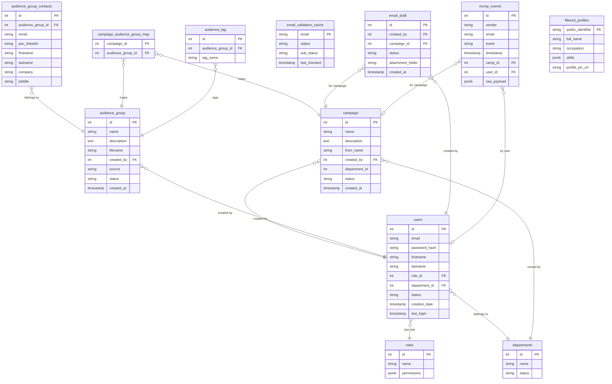

# 8. Database Documentation

## 8.1 Database Overview

- **Engine:** PostgreSQL (port 5432)
- **Access:** psycopg2 with ThreadedConnectionPool (5 min / 150 max connections)
- **ORM:** None — raw parameterized SQL throughout
- **Schemas:** 4 distinct schemas for separation of concerns

| Schema | Purpose |
|--------|---------|
| `MM_schema` | Main application data (users, campaigns, audiences, drafts) |
| `tracking` | Email event tracking (webhook events, campaign tags) |
| `scheduler` | APScheduler persistent job store |
| `MM_linkedin_schema` | LinkedIn profile enrichment data |

---

## 8.2 Connection Pool Configuration

```python
# helpers/db_connection_manager.py
POOL_MINCONN = 5            # Minimum connections (warm-up pool size)
POOL_MAXCONN = 150          # Maximum connections
POOL_RETRY_ATTEMPTS = 5     # Startup retry attempts
POOL_RETRY_DELAY = 3        # Seconds between retries

DB_CONFIG = {
    "port": "5432",
    "connect_timeout": 3,
    "keepalives": 1,
    "keepalives_idle": 30,    # Seconds before first keepalive probe
    "keepalives_interval": 10, # Seconds between keepalive probes
    "keepalives_count": 5,    # Max failed keepalives before disconnect
}
```

### Connection Usage Pattern

```python
# Always use context manager — automatically returns connection to pool
with get_db_connection() as conn:
    cursor = conn.cursor()
    cursor.execute("SELECT ... FROM ...", (params,))
    results = cursor.fetchall()
    conn.commit()  # Only on writes
    cursor.close()
```

The `get_db_connection()` context manager:
1. Gets connection from pool
2. Checks `conn.closed != 0` (stale detection)
3. Yields connection
4. On exit: calls `conn.commit()` if no exception, `conn.rollback()` if exception
5. Returns connection to pool

---

## 8.3 MM_schema Tables

### `MM_schema.users`
Core user accounts table.

| Column | Type | Notes |
|--------|------|-------|
| `id` | integer (PK) | Auto-increment |
| `email` | varchar | Unique, used as username |
| `password_hash` | varchar | bcrypt hash (12 rounds) or legacy plain |
| `firstname` | varchar | — |
| `lastname` | varchar | — |
| `role_id` | integer (FK) | → `MM_schema.roles.id` |
| `department_id` | integer (FK) | → `MM_schema.departments.id` |
| `status` | varchar | 'active' / 'inactive' |
| `creation_date` | timestamp | Registration timestamp |
| `last_login` | timestamp | Updated on each V2 login |

### `MM_schema.roles`
RBAC roles.

| Column | Type | Notes |
|--------|------|-------|
| `id` | integer (PK) | — |
| `name` | varchar | e.g., 'superadmin', 'admin', 'user' |
| `permissions` | jsonb | Module → permission list mapping |

### `MM_schema.departments`
Organizational departments for multi-tenant partitioning.

| Column | Type | Notes |
|--------|------|-------|
| `id` | integer (PK) | — |
| `name` | varchar | Department name |
| `status` | varchar | 'active' / 'inactive' |

### `MM_schema.campaign`
Email campaigns.

| Column | Type | Notes |
|--------|------|-------|
| `id` | integer (PK) | — |
| `name` | varchar | Campaign name |
| `description` | text | Used as context for AI email generation |
| `from_name` | varchar | Sender signature used in email body |
| `created_by` | integer (FK) | → `MM_schema.users.id` |
| `department_id` | integer | Department ownership |
| `status` | varchar | Campaign status |
| `created_at` | timestamp | — |

### `MM_schema.audience_group`
Audience contact groups.

| Column | Type | Notes |
|--------|------|-------|
| `id` | integer (PK) | — |
| `name` | varchar | Audience group name |
| `description` | text | — |
| `filename` | varchar | Original uploaded filename |
| `created_by` | integer | → users.id |
| `source` | varchar | 'csv', 'salesforce', 'hubspot' |
| `status` | varchar | active/inactive |
| `created_at` | timestamp | — |

### `MM_schema.audience_group_contacts`
Individual contacts within an audience group.

| Column | Type | Notes |
|--------|------|-------|
| `id` | integer (PK) | — |
| `audience_group_id` | integer (FK) | → audience_group.id |
| `email` | varchar | Contact email (used for ZeroBounce validation) |
| `poc_linkedin` | varchar | LinkedIn profile URL (used for enrichment) |
| `firstname` | varchar | — |
| `lastname` | varchar | — |
| `company` | varchar | — |
| `jobtitle` | varchar | — |
| `phone` | varchar | — |
| (many more CSV-mapped columns) | various | Dynamic from CSV upload |

**Note:** Columns are dynamically matched from CSV headers to DB column names via introspection of `information_schema.columns`.

### `MM_schema.campaign_audience_group_map`
Many-to-many mapping between campaigns and audience groups.

| Column | Type | Notes |
|--------|------|-------|
| `campaign_id` | integer (FK) | → campaign.id |
| `audience_group_id` | integer (FK) | → audience_group.id |

Constraint: `ON CONFLICT DO NOTHING` (idempotent inserts).

### `MM_schema.email_draft`
Saved email drafts before sending.

| Column | Type | Notes |
|--------|------|-------|
| `id` | integer (PK) | — |
| `created_by` | integer (FK) | → users.id |
| `campaign_id` | integer (FK) | → campaign.id |
| `status` | varchar | 'draft' / 'sent' |
| `attachment_folder` | varchar | Azure Blob folder path for attachments |
| `created_at` | timestamp | — |
| (email content columns) | various | Subject, body, recipients, etc. |

### `MM_schema.email_validation_cache`
ZeroBounce validation result cache.

| Column | Type | Notes |
|--------|------|-------|
| `email` | varchar (PK) | Normalized (lowercase, trimmed) |
| `status` | varchar | ZeroBounce status (valid/invalid/catch-all/etc.) |
| `sub_status` | varchar | Detailed sub-status |
| `last_checked` | timestamp | Used for TTL check (30-day expiry) |

### `MM_schema.audience_tag`
Tags associated with audience groups.

| Column | Type | Notes |
|--------|------|-------|
| `id` | integer (PK) | — |
| `audience_group_id` | integer (FK) | → audience_group.id |
| `tag_name` | varchar | — |

---

## 8.4 tracking Schema Tables

### `tracking.mcmp_events`
Email engagement events ingested from MCMP/Mailchimp webhooks.

| Column | Type | Notes |
|--------|------|-------|
| `id` | integer (PK) | — |
| `sender` | varchar | Sender email address |
| `email` | varchar | Recipient email address |
| `event` | varchar | 'delivered', 'open', 'click', 'bounce', 'spam', 'unsubscribe' |
| `type` | varchar | Bounce subtype |
| `timestamp` | timestamp | Event occurrence time |
| `created_at` | timestamp | DB insertion time |
| `camp_id` | integer (FK) | → campaign.id |
| `user_id` | integer (FK) | → users.id |
| `raw_payload` | jsonb | Full webhook payload |
| `subaccount` | varchar | Mailchimp/MCMP subaccount ID |
| `subject` | varchar | Email subject line |

**JSONB queries used:** Tag filtering via `raw_payload->'msg'->'tags' @> %s`

### `tracking.campaign_tags`
Tags applied to campaign runs.

| Column | Type | Notes |
|--------|------|-------|
| `campaign_id` | integer (FK) | → campaign.id |
| `tag_id` | integer (FK) | → tags table |
| `created_at` | timestamp | — |

Constraint: `ON CONFLICT DO NOTHING`

---

## 8.5 scheduler Schema Tables

### `scheduler.apscheduler_jobs`
APScheduler persistent job storage. Managed entirely by APScheduler library.

| Column | Type | Notes |
|--------|------|-------|
| `id` | varchar (PK) | Job identifier |
| `next_run_time` | float | Unix timestamp of next scheduled run |
| `job_state` | bytea | Pickled job state |

---

## 8.6 MM_linkedin_schema Tables

### `MM_linkedin_schema.filtered_profiles`
Processed LinkedIn profile data.

| Column | Type | Notes |
|--------|------|-------|
| `public_identifier` | varchar (PK) | LinkedIn username |
| `full_name` | varchar | — |
| `occupation` | varchar | — |
| `location` | varchar | — |
| `follower_count` | integer | — |
| `connections` | integer | — |
| `summary` | text | Profile summary |
| `skills` | jsonb | Array of skills |
| `profile_pic_url` | varchar | Azure Blob blob name (`{identifier}.jpg`) |

### `MM_linkedin_schema.raw_profiles`
Raw Proxycurl API response storage.

### `MM_linkedin_schema.filtered_experiences`
Work experience records linked to profile.

### `MM_linkedin_schema.filtered_activities`
LinkedIn activity records linked to profile.

---

## 8.7 Inferred Entity Relationship Diagram



---

## 8.8 Data Access Patterns

### Pattern 1: Simple Fetch with Pagination
```python
PAGINATION_CLAUSE = " LIMIT %s OFFSET %s"
query = 'SELECT * FROM "MM_schema".campaign WHERE ...' + PAGINATION_CLAUSE
cursor.execute(query, (*filter_params, limit, offset))
```

### Pattern 2: Batch Insert (CSV Upload)
```python
# Uses psycopg2's execute_values for high-performance batch insert
execute_values(cursor, insert_query, values)
```

### Pattern 3: Upsert (Idempotent Inserts)
```python
# Used for event mapping, tag mapping
INSERT INTO ... VALUES (%s, %s) ON CONFLICT DO NOTHING
```

### Pattern 4: JSONB Filtering (Event Tags)
```python
# Query events by JSONB tag content
WHERE raw_payload->'msg'->'tags' @> %s
```

### Pattern 5: Soft Delete
Events are never deleted; contacts and campaigns use `status = 'inactive'` pattern (inferred from status fields on tables).

---

## 8.9 Transaction Handling

The `get_db_connection()` context manager handles transactions:

```python
@contextmanager
def get_db_connection():
    conn = connection_pool.getconn()
    try:
        yield conn
        conn.commit()      # Auto-commit on success
    except Exception:
        conn.rollback()    # Auto-rollback on any exception
        raise
    finally:
        connection_pool.putconn(conn)
```

**Important:** Code within the `with get_db_connection()` block should **not** call `conn.commit()` manually unless they need intermediate commits (some helpers do call explicit `conn.commit()` — this is redundant but harmless).

---

## 8.10 Query Safety

All DB queries use **parameterized queries** with psycopg2:
```python
cursor.execute("SELECT * FROM table WHERE id = %s", (user_id,))
```

String formatting is never used for query construction with user input. This prevents SQL injection. Dynamic column selection (e.g., CSV upload) uses `information_schema` introspection to get whitelisted column names before constructing insert queries.
