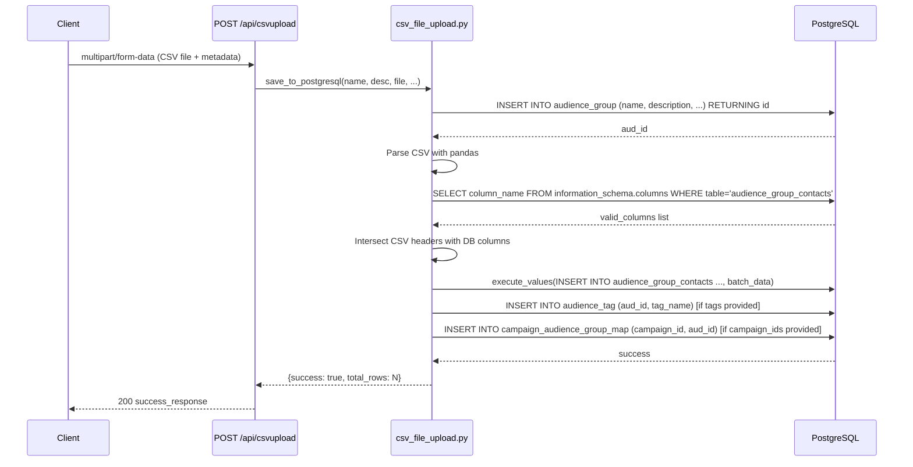
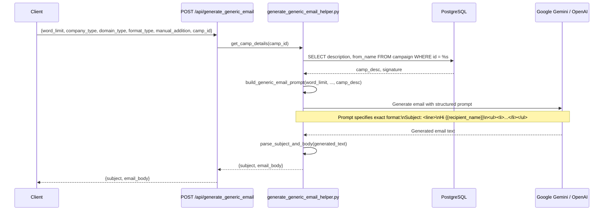
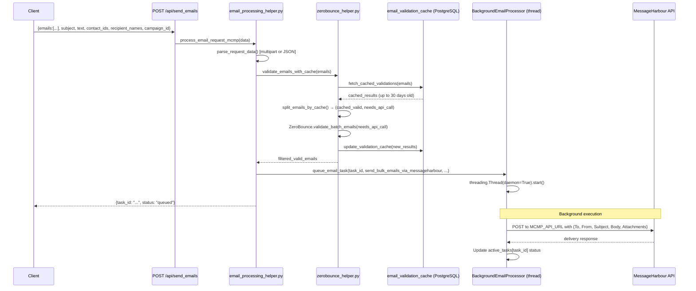
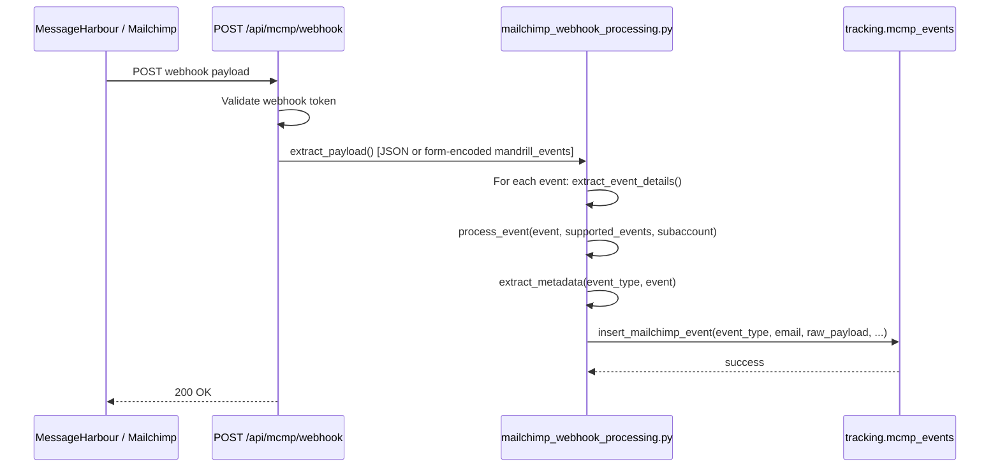
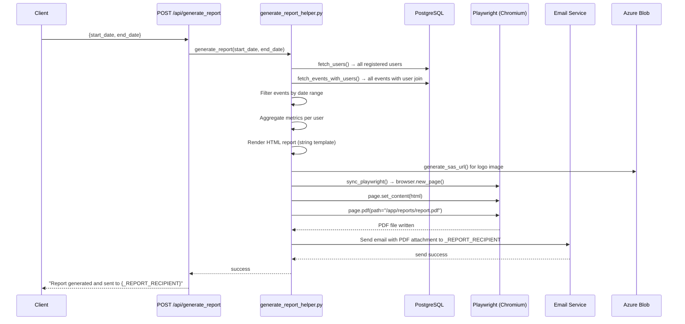
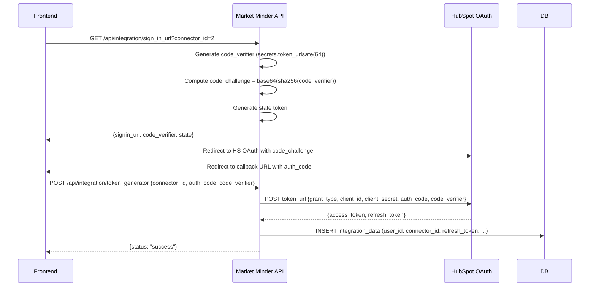
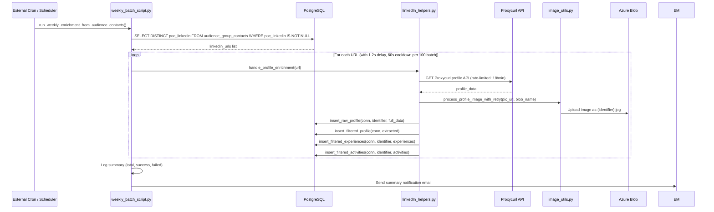

# 10. Module Deep Dive

## 10.1 Campaign Management Module

### Responsibility
CRUD operations on email campaigns. Campaigns are the top-level organizational unit — they define the purpose and context of email outreach, and they map to one or more audience groups.

### Architecture
```
api/manage_campaign/
  get_all_camp_list.py   → helpers/db_operations.py (paginated query)
  post_camp_data.py      → helpers/db_operations.py (get/update/delete)
  post_create_camp.py    → helpers/db_operations.py + audience group mapping + tag mapping
  post_delete_campaign.py
  post_update_campaign_audience_group_mapping.py
```

### Key Workflows

**Creating a Campaign:**
1. POST `/api/create_camp` with name, description, from_name
2. Inserts into `MM_schema.campaign`
3. For each `audience_group_id`: inserts into `campaign_audience_group_map`
4. For each tag: inserts into `tracking.campaign_tags`
5. All operations in single transaction

**Campaign Scoping:**
- superadmin sees all campaigns
- admin sees campaigns in their `department_id`
- user sees only campaigns `created_by` their `user_id`

### Internal Dependencies
- `helpers/db_operations.py` — all campaign DB queries
- `helpers/authenticate.py` — auth decorators
- `helpers/response.py` — response builders

### Failure Points
- Campaign creation succeeds but audience mapping fails: no rollback across operations (partial state possible if cursor commits between steps)
- No cascading delete: deleting a campaign may leave orphaned `campaign_audience_group_map` rows

---

## 10.2 Audience Management Module

### Responsibility
Manage contact groups that can be imported from CSV, Salesforce, or HubSpot and assigned to campaigns.

### Architecture
```
api/manage_audience/
  post_native_audience_data.py  → helpers/csv_file_upload.py
  post_integration_audience_data.py → helpers/csv_file_upload.py (from CRM data)
  post_aud_contact_data.py      → DB query on audience_group_contacts
  post_status_audience.py       → Status update
  post_delete_audience.py       → Delete audience group + contacts
  get_all_audience_list.py      → Paginated list with campaign mappings
  get_export_audience.py        → CSV export
```

### CSV Upload Pipeline



**Dynamic Column Mapping:** The CSV upload introspects the actual DB schema via `information_schema.columns` to determine which CSV columns map to DB columns. This is flexible but means new columns must be added to the DB before they appear in imports.

### Deduplication
Available via `POST /api/normalise_audiences`:
- Email normalization: lowercase + strip whitespace
- First occurrence wins (by list order)
- Returns both distinct and duplicate datasets for frontend display

### Failure Points
- No email format validation during CSV upload (validation happens at send time via ZeroBounce)
- Large CSV uploads may hold a DB connection for a long time during `execute_values`
- No progress reporting for large uploads

---

## 10.3 Run Campaign / Email Generation Module

### Responsibility
The core email workflow: fetch contacts, generate AI emails, validate recipients, send, track, and schedule follow-ups.

### Architecture
```
api/run_campaign/
  fetch_contacts_by_groups.py  → contact fetch with LinkedIn profile join
  post_generic_email_generate.py → AI generic email generation
  post_followup_email_generate.py → AI follow-up email generation
  post_send_mail.py            → Email dispatch (MCMP or Mailchimp)
  get_background_email_status.py → Task status polling
  post_draft.py                → Draft save/load
  post_normalise_audiences.py  → Deduplication
  get_draft_list.py            → Draft listing
  get_email_quota.py           → Quota check
  get_domain_list.py           → Sender domain list
  get_industry_list.py         → Industry options
  get_run_camp_data.py         → Campaign run view data
  post_get_profile.py          → LinkedIn profile fetch
```

### AI Email Generation Pipeline



### Email Send Pipeline



### Follow-up Email Scheduling

When `schedule_follow_up: true` is passed in the send request:

```python
# email_processing_helper.py
scheduler.add_job(
    func=execute_scheduled_email_job,
    trigger='date',
    run_date=scheduled_time,  # User-specified IST datetime
    args=[contact_id, campaign_run_id, ...],
    id=unique_job_id,
    replace_existing=True
)
```

Jobs are persisted in `scheduler.apscheduler_jobs` and survive app restarts.

### Failure Points
- `BackgroundEmailProcessor.active_tasks` is a plain dict; in a multi-worker deployment, tasks on different workers won't be visible to status polling on another worker
- Email validation skipped if `skip_validation=true` in request — must be used carefully
- No retry for failed MCMP sends in the background processor
- Daemon threads are killed without cleanup if process exits unexpectedly

---

## 10.4 Tracking & Analytics Module

### Responsibility
Ingest email engagement events via webhooks, store them in PostgreSQL, and provide analytics query APIs for dashboards.

### Webhook Ingestion



Supported event types: `delivered`, `open`, `click`, `bounce`, `spam`, `unsubscribe`

### Dashboard Filtering

Events can be filtered by:
- `period` (daily/weekly/monthly/yearly) or custom `time_range` (start,end dates)
- `sender` email
- `tags` (JSONB query on `raw_payload`)
- `campaign_id`

Default time range: 1 month if no filter specified.

### Analytics Data Model

The `get_operational_analytics` endpoint returns all widget data in a single query. `operational_analytics_helper.py` provides:
- Device analytics
- Geographic distribution
- Email performance metrics (open rate, click rate, bounce rate)
- Timeline data

---

## 10.5 Reporting Module

### Responsibility
Generate periodic PDF reports of email activity and email them to a designated recipient.

### Report Generation Flow



**Report Recipient:** Hardcoded in `generate_report_helper.py` as `_REPORT_RECIPIENT`. This needs to be made configurable.

**Playwright Dependency:** Chromium browser must be installed in the Docker image (done in Dockerfile with `playwright install chromium`).

---

## 10.6 User & Roles Module

### Responsibility
Manage users, roles, and departments with full RBAC enforcement.

### Key Operations

**User Creation Flow:**
1. Admin creates user via `POST /api/users_data` (action=create)
2. User record created without password
3. `POST /api/resend_password_create_mail` sends onboarding email
4. User clicks link → `POST /api/onboard_create_password` → sets password

**Permission Assignment:**
- Permissions are stored in `MM_schema.roles.permissions` as JSONB
- When user logs in (V2), permissions are fetched from the role and embedded in JWT
- Permission initials are computed via `perms_initial_converter()`

**Department Scoping:**
- All users belong to a department
- Admins can see all data within their department
- Department status affects user access (inactive department → restricted access, inferred)

---

## 10.7 Integration Module

### Responsibility
OAuth2 integration with Salesforce and HubSpot to import contacts directly into audience groups.

### Architecture

```
api/integration/
  sign_in_url.py          → get_sign_in_url(connector_id)
  token_generator.py      → generate_tokens(connector_id, auth_code, ...)
  get_account_contact_data.py → fetch_integration_accounts(...)
  get_update_integration_data.py
  get_integration_data_for_filters.py

helpers/integration_helper.py  → CRM dispatcher (routes by connector_id)
helpers/salesforce_integration_helper.py → Salesforce OAuth + API
helpers/hubspot_integration_helper.py    → HubSpot OAuth + API
helpers/integration_db_helper.py         → Token storage in DB
```

### HubSpot PKCE Flow



---

## 10.8 Email Template Module

### Responsibility
CRUD management of reusable email templates that users can select during campaign runs.

### Key Files
- `api/email_template/post_create_email_template.py`
- `api/email_template/post_get_all_email_templates.py`
- `api/email_template/post_delete_email_template.py`
- `helpers/email_template_helper.py` — DB operations

Templates are stored in the PostgreSQL DB (inferred table: `MM_schema.email_templates`).

---

## 10.9 Enrichment Pipeline Module

### Responsibility
Weekly batch job that enriches audience contacts with LinkedIn profile data via the Proxycurl API.

### Architecture
```
enrichlayer_pipeline/
  weekly_batch_script.py        → Main batch runner
  single_test_script.py         → Test single URL
  db_insert.py                  → Insert functions for all 4 enrichment tables
  enrichment_summary_notifier.py → Send summary email after batch
  Dockerfile.enrich              → Separate container image
```

### Enrichment Pipeline



**Rate Limiting:** The `RateLimiter` (token bucket) limits Proxycurl API calls to 18/minute. Between batches of 100, there's a 60-second cooldown. Between individual profiles, there's a 1.2-second sleep. This is conservative and suitable for Proxycurl's rate limits.

**Separate Dockerfile:** The enrichment pipeline has its own `Dockerfile.enrich`, allowing it to run as a separate container/service independent of the main API.

---

## 10.10 Automation Admin Module

### Responsibility
Manage the automated follow-up system: alert switches control whether automated emails are sent to specific contacts, and the review mail module allows admins to inspect sent email history.

### Alert Switch System

The alert switch is stored in an **Azure Table** (`triggertable`) rather than PostgreSQL. The `AlertSwitch` column is a boolean per LinkedIn username:

```python
# automation_helper.py
def get_follow_up_alert_status(queue_name, threshold_days=16, max_no_of_follow_ups=2):
    # Reads AlertSwitch from Azure Table
    # If AlertSwitch = False → no follow-up (admin-blocked)
    # Checks Azure Queue for message age and count
    # If messages >= max_no_of_follow_ups + 1 → stop (limit reached)
    # If latest message < threshold_days old → no alert needed
```

**Azure Queue Usage:** Each contact has an associated Azure Queue. Messages in the queue represent sent follow-up emails. Queue message age determines if a follow-up is overdue.

### Unsubscribe Management

Unsubscribed contacts are stored in **Azure Table** (`unSubscribedData`). Before sending any email, the send pipeline checks this table to skip unsubscribed recipients.
