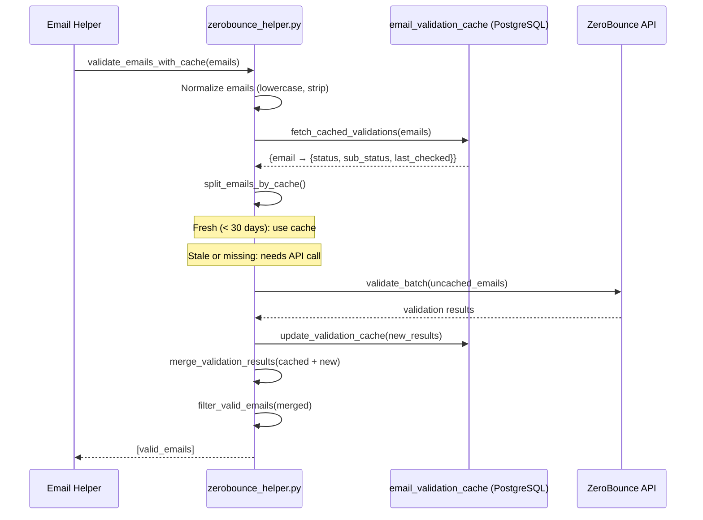

# 11. External Integrations

## 11.1 Integration Overview

| Integration | Type | Connector ID | Purpose |
|-------------|------|-------------|---------|
| Salesforce | CRM via OAuth2 | 1 | Import contacts/accounts |
| HubSpot | CRM via OAuth2 PKCE | 2 | Import contacts/companies |
| MessageHarbour (MCMP) | REST API | — | Primary bulk email sender |
| Mailchimp Transactional | SDK | — | Alternative email sender |
| ZeroBounce | SDK + cache | — | Email address validation |
| Proxycurl (LinkedIn) | REST + rate limiter | — | Profile enrichment |
| Google Gemini | SDK | — | AI email generation |
| OpenAI (Azure) | SDK | — | Alternative AI email generation |
| Mistral AI | SDK | — | Alternative LLM |
| Azure Key Vault | SDK | — | All secrets management |
| Azure Blob Storage | SDK | — | Files, attachments, images, reports |
| Azure Table Storage | SDK | — | Lookup tables, automation state |
| Azure Queue Storage | SDK | — | Follow-up automation messages |

---

## 11.2 Salesforce Integration

### Config: `configuration/salesforce_config.py`
```python
AUTH_URL = "https://login.salesforce.com/services/oauth2/authorize"
TOKEN_URL = "https://login.salesforce.com/services/oauth2/token"
REDIRECT_URI = f"{base_url}/callback"
CONNECTOR_ID = 1
```

### OAuth Flow (Password Grant + Auth Code)
- OAuth2 **password grant** for backend service access (username + password + security_token)
- OAuth2 **auth code** flow for user-initiated integration connect
- Tokens stored in PostgreSQL integration table

### Data Fetching
```python
# salesforce_helper.py
get_access_token_and_instance_url()  # Password grant
get_campaign_names(access_token, instance_url)  # SOQL query
# SOQL: SELECT Id, Name, (SELECT Marketing_Campaign_Name1__c FROM Contacts) FROM Account
```

- Pagination handled via `nextRecordsUrl` pattern
- All records collected before returning

### Failure Points
- Password grant is not recommended for production (credential exposure risk)
- No token refresh for password grant — re-authenticates on expiry
- `print(payload)` in `get_access_token_and_instance_url()` logs credentials — **security risk**

---

## 11.3 HubSpot Integration

### Config: `configuration/integration_config.py → hubspot_config`
```python
CONNECTOR_ID = 2
AUTH_URL = "https://app.hubspot.com/oauth/authorize"
TOKEN_URL = "https://api.hubapi.com/oauth/v1/token"
SCOPES = ["oauth", "crm.objects.contacts.read", "crm.objects.companies.read"]
CONTACTS_API_URL = "https://api.hubapi.com/crm/v3/objects/contacts"
```

### PKCE Flow
```python
# hubspot_integration_helper.py
code_verifier = secrets.token_urlsafe(64)            # Cryptographically random
sha256_hash = hashlib.sha256(code_verifier.encode()).digest()
code_challenge = base64.urlsafe_b64encode(sha256_hash).decode().rstrip("=")
state = secrets.token_urlsafe(16)                    # CSRF protection
```

The frontend stores `code_verifier` and `state` during the OAuth dance, passing them back when exchanging the auth code.

### Token Refresh
```python
hubspot_refresh_access_tokens(refresh_token)
# Posts to TOKEN_URL with grant_type=refresh_token
# Returns new access_token
```

### Data Fetching
- `hubspot_get_all_companies(access_token)` — fetches all companies
- `hubspot_get_contacts_by_company(access_token, account_ids, filters)` — contacts per company
- Uses HubSpot CRM v3 batch API

---

## 11.4 MessageHarbour (MCMP) Integration

### Config: `configuration/generic_config.py`
```
MCMP-API-KEY     → API key
MCMP-SECRET-KEY  → Secret key
MCMP-API-URL     → Endpoint URL
MCMPWebhookToken → Webhook validation token
mcmpquotaapikey  → Quota check key
```

### Send Flow
```python
# mcmp_send_mail_helper.py
send_bulk_emails_via_messageharbour(
    to_emails, subject, body, from_email,
    recipient_names, attachments, skip_validation
)
```

1. Validate recipients via ZeroBounce (unless `skip_validation=True`)
2. Prepare attachments as multipart tuples
3. POST to MCMP API URL with `{To, From, Subject, Body, ...Attachments}`
4. Log results per recipient

### Webhook Ingestion
```python
# POST /api/mcmp/webhook
# Validates MCMPWebhookToken header
# Parses JSON or form-encoded mandrill_events
# Inserts to tracking.mcmp_events
```

### Attachment Handling
```python
# Attachments: list of {type, name, content (base64)}
# Decoded from base64 → bytes → sent as multipart files
file_tuples.append(('Attachments', (filename, file_bytes, content_type)))
```

---

## 11.5 Mailchimp Transactional Integration

### Config: `configuration/generic_config.py`
```
genericMailchimpApiKey → Mailchimp API key
MailchimpSubaccountID  → Subaccount identifier
```

### Toggle
```python
# generic_config.py
param.use_mailchimp = False  # Currently disabled — MCMP is primary
```

### Send Flow (when enabled)
```python
# send_mail.py
mailchimp = MailchimpTransactional.Client(api_key)
mailchimp.messages.send({
    "message": {
        "subject": ...,
        "html": body,
        "to": [{"email": ..., "name": ..., "type": "to"}],
        "from_email": ...,
        "from_name": ...,
    }
})
```

---

## 11.6 ZeroBounce Email Validation

### Purpose
Validates email addresses before sending to reduce bounces and protect sender reputation.

### Caching Strategy


- Cache TTL: **30 days** (configurable via `CACHE_TTL_DAYS`)
- Cache stored in `MM_schema.email_validation_cache`
- Normalization ensures consistent cache hits

### Valid Status Values
ZeroBounce returns: `valid`, `invalid`, `catch-all`, `spamtrap`, `abuse`, `do_not_mail`, `unknown`

Only `valid` (and optionally `catch-all`) emails are sent to.

---

## 11.7 Proxycurl / LinkedIn Enrichment

### Config: `configuration/linkedIn_config.py`
```python
# Proxycurl API key stored in Azure Key Vault
```

### Rate Limiting
```python
# rate_limit_utils.py
proxycurl_rate_limiter = RateLimiter(max_calls=18, period=60)  # 18 calls/60 seconds

@rate_limited_retry(max_retries=5, backoff_factor=1.0, status_codes=(429, 500, 502, 503, 504))
def fetch_profile_data(url):
    # Calls Proxycurl API
    # Rate limiter waits if token bucket is empty
    # Retries with exponential backoff on 429/5xx
```

### Profile Data Storage
- **Raw:** `MM_linkedin_schema.raw_profiles` — full API response
- **Filtered:** `MM_linkedin_schema.filtered_profiles` — key fields only
- **Experiences:** `MM_linkedin_schema.filtered_experiences`
- **Activities:** `MM_linkedin_schema.filtered_activities`
- **Profile images:** Azure Blob as `{public_identifier}.jpg`

### Cache Strategy
Before calling Proxycurl, the system checks if `public_identifier` already exists in `filtered_profiles`. Only new profiles trigger API calls:
```python
existing_ids, new_ids = split_existing_and_new_public_ids(public_ids)
```

---

## 11.8 Google Gemini / LLM Integration

### Config: `configuration/generate_mail_config.py`
```
geminiApiKey     → Google Gemini API key
openRouterApiKey → OpenRouter API key
gmOpenaiKey      → Azure OpenAI key
gmApiBase        → Azure OpenAI endpoint
gmengine         → Deployment name
```

### Email Generation
- Prompts are structured with **FORMAT CONTRACT** instructions to ensure consistent output
- Subject must be first line as `Subject: <text>`
- Salutation: `Hi {{recipient_name}}` (double braces preserved for server-side substitution)
- Service list in HTML `<ul><li>` format

### AI Provider Selection
The LLM provider is selected within the helper based on config. Multiple models (Gemini, OpenAI, Mistral, OpenRouter) appear to be available; the active one is determined by which API key is configured and which path is invoked. (Inferred: Gemini is primary based on `google-genai` SDK presence.)

---

## 11.9 Azure Storage Integration

### Azure Blob Storage
Used for:
| Container | Content |
|-----------|---------|
| `draft-attachments` | Email draft attachments (UUID-named folders) |
| Reports directory | Generated PDF reports (local `/app/reports` or Azure Blob) |
| Profile images | LinkedIn profile photos `{identifier}.jpg` |

SAS URLs are generated with time-limited read access for frontend display:
```python
# asset_service_helper.py
generate_sas_url("container/blob_name", expiry_days=2)
```

### Azure Table Storage
Used for non-relational, schema-free data:
| Table | Data |
|-------|------|
| `userProfileData` | User LinkedIn profile snapshots |
| `unSubscribedData` | Unsubscribed email addresses |
| `triggertable` | Per-contact AlertSwitch boolean |
| Domain/Company type tables | Lookup reference data |
| SF campaign names | Salesforce campaign name cache |

### Azure Queue Storage
Used for automation message tracking:
- Each automated contact has a queue named after their LinkedIn username
- Queue messages represent sent follow-up emails
- Message count and age determine if more follow-ups should be sent
