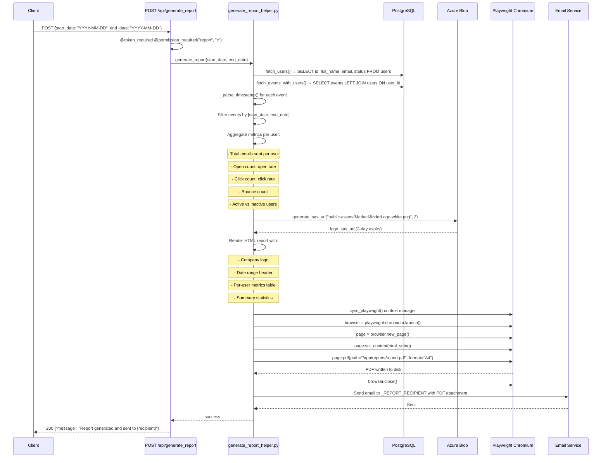

# 12. Reporting System

## 12.1 Overview

The reporting system generates **PDF analytics reports** covering email activity across a date range. Reports are generated on-demand via `POST /api/generate_report` and delivered by email to a configured recipient.

The system uses **Playwright (Chromium)** to render an HTML report page to PDF — a browser-based PDF generation approach that produces print-quality output with CSS styling.

---

## 12.2 Report Generation Flow



---

## 12.3 Data Fetching Layer

### `fetch_users()`
```sql
SELECT id, (firstname || ' ' || lastname) AS full_name, email, status
FROM "MM_schema".users
```
Returns all registered users to compute:
- Total registered users
- Active vs inactive split
- Users with zero email activity (set difference)

### `fetch_events_with_users()`
```sql
SELECT e.id, e.sender, e.email, e.event, e.type, e.timestamp, e.created_at,
       e.camp_id, e.user_id,
       (u.firstname || ' ' || u.lastname) AS full_name, u.email AS user_email
FROM tracking.mcmp_events e
LEFT JOIN "MM_schema".users u ON e.user_id = u.id
```
Returns all events with owning user context in a single query (LEFT JOIN to include events without matched users).

---

## 12.4 Timestamp Parsing

The `_parse_timestamp()` function handles multiple timestamp formats:
- `datetime` objects (strips tzinfo)
- `date` objects
- Strings in `YYYY-MM-DD HH:MM:SS.fff +0530` format (strips timezone offset)

This is necessary because PostgreSQL timestamps may be returned with timezone info depending on the column type.

---

## 12.5 HTML Report Structure

The report is rendered as an HTML string with:
- Embedded CSS for A4 print layout
- Market Minder logo (SAS URL with 2-day expiry)
- Header with report date range
- Per-user metrics table (name, emails sent, opens, clicks, bounces, rates)
- Summary section (total users, active users, aggregate metrics)
- `CLOSING_HTML` constant appended to close table sections

**Potential Issue:** The SAS URL expires in 2 days. If the PDF is archived and the logo URL is embedded, it will break after 2 days. The PDF generation is immediate so this is generally fine, but the HTML intermediate is not cached.

---

## 12.6 PDF Generation (Playwright)

```python
with sync_playwright() as playwright:
    browser = playwright.chromium.launch()
    page = browser.new_page()
    page.set_content(html_string)
    page.pdf(path="/app/reports/report.pdf", format="A4")
    browser.close()
```

**Output location:** `/app/reports/report.pdf` — a local file within the container.

**Chromium dependencies:** The Dockerfile installs all required system libraries for Chromium headless operation.

**Scaling consideration:** Playwright PDF generation is memory-intensive (full browser). Concurrent report generation requests could exhaust container memory. There is no queuing/concurrency limit on report generation.

---

## 12.7 Report Delivery

The PDF is emailed to `_REPORT_RECIPIENT` (hardcoded in `generate_report_helper.py`). The PDF file is attached inline to the email.

**Operational Gap:** The report recipient is hardcoded. To change the recipient requires a code change. This should be made configurable (e.g., per-user, or as a Key Vault secret).

---

## 12.8 Operational Analytics

The `GET /api/operational_analytics` endpoint provides real-time dashboard data without PDF generation. It aggregates:

```python
# operational_analytics_helper.py
get_complete_operational_analytics(start_date, end_date, campaign_id, campaign_name, sender, tag, period)
```

Returns all widget data in a single response:
- Device breakdown
- Geographic distribution  
- Email performance (open rate, click rate, bounce rate, spam rate)
- Timeline trends
- Top senders
- Campaign performance

The `execute_query()` utility in `operational_analytics_helper.py` wraps all queries with typed exceptions:
- `DatabaseConnectionError` — connection failed
- `DatabaseQueryError` — syntax error, data error, integrity error

---

## 12.9 Dashboard Event Query System

`helpers/dashboard_helper.py` provides reusable filter builders:

| Function | Purpose |
|----------|---------|
| `_build_time_filter(time_range, period, now)` | Period or custom date range filter |
| `_build_tags_filter(tags)` | JSONB tag filter for raw_payload |
| `_get_period_date_range(period, now)` | Convert period name to start/end dates |
| `build_mcmp_event_filters(...)` | Compose complete WHERE clause |
| `run_mcmp_metrics_query(...)` | Execute filtered event count query |
| `run_mcmp_metrics_query_batch(...)` | Batch version for multiple metrics |

**JSONB Tag Query:**
```sql
WHERE raw_payload->'msg'->'tags' @> '["[tagname]"]'
```
Tags in the payload are stored with surrounding brackets `[tagname]`.

---

## 12.10 Event Count API Response Format

```json
{
  "statuscode": 200,
  "message": "success",
  "data": {
    "delivered": 1250,
    "open": 430,
    "click": 87,
    "bounce": 12,
    "spam": 2,
    "unsubscribe": 5
  },
  "total_records": 6,
  "error": []
}
```
