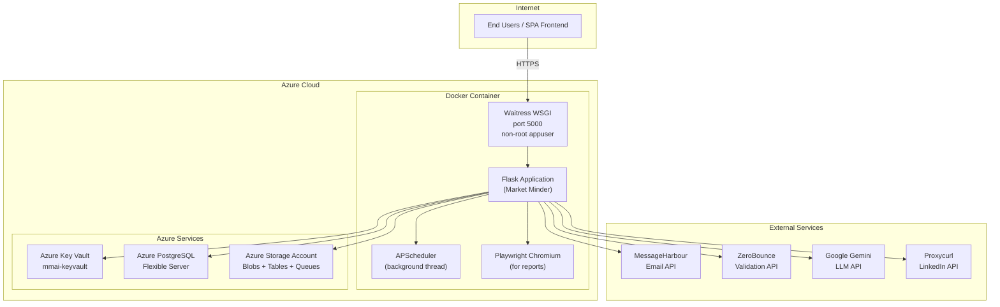
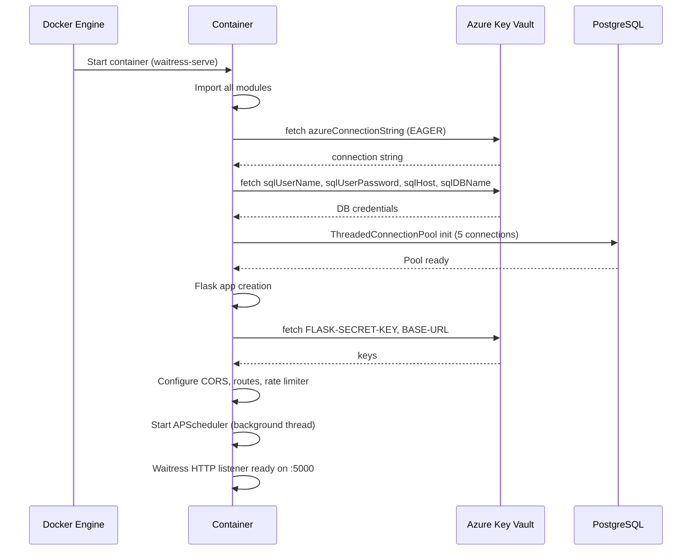

# 16. Deployment Architecture

## 16.1 Production Deployment Overview



---

## 16.2 Docker Configuration

### Production Dockerfile (root `Dockerfile`)

```dockerfile
FROM python:3.12-slim-bookworm

WORKDIR /app
COPY . /app

# Install OS packages for Playwright Chromium
RUN apt-get update && apt-get upgrade -y && apt-get install -y \
    ca-certificates fonts-liberation libasound2 libatk-bridge2.0-0 \
    libatk1.0-0 libcups2 libdbus-1-3 libdrm2 libgbm1 libglib2.0-0 \
    libgtk-3-0 libnspr4 libnss3 libpango-1.0-0 libpangocairo-1.0-0 \
    libx11-6 libx11-xcb1 libxcb1 libxcomposite1 libxdamage1 libxext6 \
    libxfixes3 libxrandr2 libxshmfence1 xdg-utils

ENV PLAYWRIGHT_BROWSERS_PATH=/ms-playwright

RUN find . -name '*.pyc' -delete && find . -name '__pycache__' -type d -exec rm -rf {} + \
 && pip install --no-cache-dir --upgrade pip \
 && pip install --no-cache-dir -r requirements.txt \
 && pip install --no-cache-dir waitress \
 && playwright install chromium

# Non-root user for security
RUN addgroup --system appgroup && adduser --system --ingroup appgroup appuser \
 && mkdir -p /app/reports \
 && chown -R appuser:appgroup /app \
 && chmod -R 755 /ms-playwright

USER appuser
EXPOSE 5000

CMD ["waitress-serve", "--port=5000", "--call", "main:create_app"]
```

### Enrichment Dockerfile (`enrichlayer_pipeline/Dockerfile.enrich`)
Separate image for the LinkedIn enrichment batch pipeline — runs independently on a schedule.

---

## 16.3 WSGI Server: Waitress

Waitress is a production-grade pure-Python WSGI server:
- **No Nginx required** — Waitress handles HTTP directly
- **Thread-based concurrency** (not async)
- **Single-process** (no master/worker forking like Gunicorn)
- Runs as non-root `appuser`

**Why Waitress over Gunicorn?**  
Waitress is simpler and avoids the `--preload` + forking complexity that can break APScheduler (which starts a background thread). With Gunicorn in fork mode, the scheduler would be started in the master process and not survive in worker processes.

**Gunicorn** is in `requirements.txt` but is NOT the active WSGI server (Waitress is used in the CMD).

---

## 16.4 Container Security

| Security Measure | Implementation |
|-----------------|---------------|
| Non-root user | `appuser` (system user, no shell) |
| Minimal OS packages | `slim-bookworm` base + only required libs |
| No hardcoded secrets | All secrets via Azure Key Vault |
| Package cache cleared | `--no-cache-dir` on pip installs |
| Python cache cleared | Pre-build cleanup of `__pycache__` |
| Report directory | Created and owned by appuser only |

---

## 16.5 Port Configuration

| Port | Service | Notes |
|------|---------|-------|
| 5000 | Waitress HTTP | Exposed in Dockerfile |
| 5432 | PostgreSQL | Internal Azure network |
| — | Azure Key Vault | HTTPS 443 |
| — | Azure Storage | HTTPS 443 |

There is **no Nginx reverse proxy** in the Docker configuration. If HTTPS termination is needed, it must be handled by an upstream load balancer (e.g., Azure Application Gateway, Azure Front Door, or reverse proxy container).

---

## 16.6 Production vs Dev Detection

Detected at runtime from the `BASE-URL` secret in Azure Key Vault:

| Environment | `BASE-URL` value | Swagger | CORS Origins |
|-------------|-----------------|---------|-------------|
| Production | `https://marketminderai.compunnel.com` | Disabled | `https://marketminderai.compunnel.com` only |
| Dev/Staging | Any other value | Enabled at `/swagger` | `localhost:5173` + `https://marketminderai-dev.compunnel.com` |

---

## 16.7 Local Development Stack

```
python main.py
  → Flask dev server (port 5000, host 127.0.0.1, debug=False)
```

Or with Docker:
```bash
docker build -t market-minder .
docker run -p 5000:5000 \
  -v ./configuration/.env:/app/configuration/.env \
  market-minder
```

The `.env` file must be mounted to provide Azure Key Vault credentials.

---

## 16.8 CI/CD

A `.github/` directory exists in the repository, indicating GitHub Actions workflows are configured. The specific workflow files were not analyzed in detail but the presence of `pytest` and `.coverage` files suggests automated test runs on push/PR.

---

## 16.9 Deployment Diagram — Application Startup



---

## 16.10 Scaling Considerations

### Current Architecture Limits
- **Single process, single instance** — no horizontal scaling configured
- **In-memory rate limiter** — must switch to Redis for multi-instance
- **In-memory task state** — must use Redis/DB for multi-instance
- **Playwright PDF** — memory-intensive, not concurrent-safe

### Path to Scale
1. Replace Flask-Limiter storage with Redis: `storage_uri="redis://..."`
2. Replace `BackgroundEmailProcessor.active_tasks` with Redis-backed task state
3. Ensure APScheduler PostgreSQL job store handles distributed locking (it does natively)
4. Put Azure Application Gateway or Front Door in front for HTTPS + load balancing
5. Consider separating the Playwright report generation into its own container
